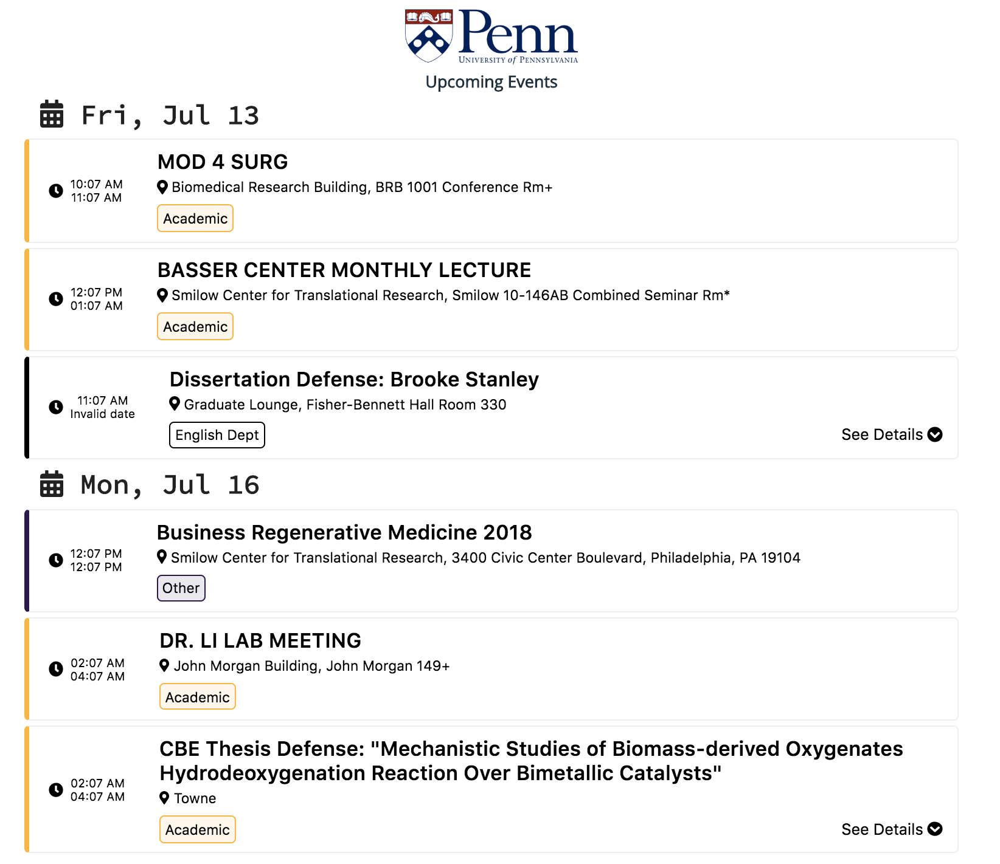

# Events at University of Pennsylvania

All events happening with event recommendations at University of Pennsylvania in an easy-to-use UI.

## Run web server locally

First, make sure that you have all Python backend as mentioned in `backend/requirements.txt` and recent version of `npm` installed (NodeJS 8+).

In order to run the web-application, if it is the first time, you need to install `gatsby-cli`:

```sh
# only once on first time
npm install -g gatsby-cli
```

and run from the `gatsby_site` folder as follows:

```sh
cd gatsby_site
npm install
gatsby develop
```

This will run Gatsby site on port `8000`. You will see the demo looks something like the following:




## Members

- [titipata](https://github.com/titipata)
- [bluenex](https://github.com/bluenex)
- [kittinan](https://github.com/kittinan)


## Contributions

We are very welcome to all contribution. If you spot any errors, please
feel free to report in the issue folder.